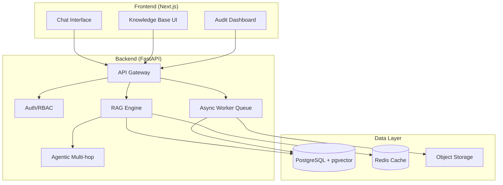

# Architecture

```mermaid
graph TB
    subgraph Frontend["Frontend (Next.js)"]
        UI[Chat Interface]
        KB[Knowledge Base UI]
        AUD[Audit Dashboard]
    end
    
    subgraph Backend["Backend (FastAPI)"]
        API[API Gateway]
        AUTH[Auth/RBAC]
        RAG[RAG Engine]
        AGENT[Agentic Multi-hop]
        ASYNC[Async Worker Queue]
    end
    
    subgraph Data["Data Layer"]
        DB[(PostgreSQL + pgvector)]
        CACHE[(Redis Cache)]
        STORAGE[Object Storage]
    end
    
    UI --> API
    KB --> API
    AUD --> API
    API --> AUTH
    API --> RAG
    RAG --> AGENT
    API --> ASYNC
    RAG --> DB
    RAG --> CACHE
    ASYNC --> DB
    ASYNC --> STORAGE
```
